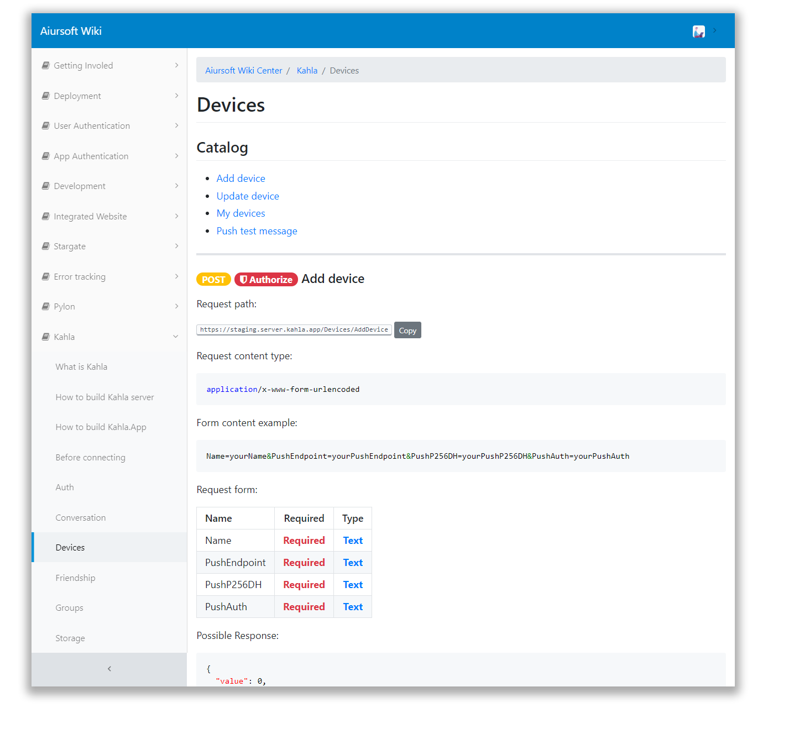

# ASP.NET Core API Document Generator

[](https://gitlab.aiursoft.cn/aiursoft/infrastDocGeneratorructures/-/blob/master/LICENSE)
[](https://gitlab.aiursoft.cn/aiursoft/DocGenerator/-/pipelines)
[](https://gitlab.aiursoft.cn/aiursoft/DocGenerator/-/pipelines)
[](https://www.nuget.org/packages/Aiursoft.DocGenerator/)
[](https://gitlab.aiursoft.cn/aiursoft/docgenerator/-/commits/master?ref_type=heads)
[](https://wiki.aiursoft.com)

A basic API document generator for ASP.NET Core applications. Open source, offline and free.

<div align=center>
    
</div>

## Features

* Generate Markdown
* Generate Json

[Open the example](https://wiki.aiursoft.com/Kahla/Devices.md)

## Supports

* ASP.NET Core 6.0

## How to use

First, install `Aiursoft.DocGenerator` to your ASP.NET Core project from nuget.org:

```bash
dotnet add package Aiursoft.DocGenerator
```

Simply add this line in your `Startup.cs`:

```csharp
using Aiursoft.DocGenerator.Services;

public void Configure(IApplicationBuilder app, IWebHostEnvironment env)
{
    // ...
    // your middlewares
    // ...
    
    app.UseAiursoftDocGenerator(); // <- Add this.
}
```

Start your application and browse:

```
/doc
```

It just returns your document in JSON format.

```json
[{
	"ControllerName": "HomeController",
	"ActionName": "Index",
	"AuthRequired": false,
	"IsPost": false,
	"Arguments": [],
	"PossibleResponses": ["{\"code\":0,\"message\":\"success.\"}"]
}]
```

That's all! Happy coding!

Continue? Try runing the example project! Or continue reading.

## Customization and API

### Change document output address

```csharp
app.UseAiursoftDocGenerator(options =>
{
    // Default value is '/doc'. You can change it to other path.
    options.DocAddress = "/my-doc";
});
```

### Change document output format

```csharp
app.UseAiursoftDocGenerator(options =>
{
    // Default format is JSON. You can change it to markdown.
    options.Format = DocFormat.Markdown;
});
```

### Set global possible responses

```csharp
app.UseAiursoftDocGenerator(options =>
{
    // Default global possible response is an empty list.
    options.GlobalPossibleResponse.Add(new { code = 0, message = "success." });
});
```

### Set possible response for one API

When you can ensure the possible response for one API, add this line to your action:

```csharp
[Produces(typeof(ResponseModel))] // <- add this in your controller.
public IActionResult HasOutput()
{
    var model = new ResponseModel(); // <- your own class and logic
    return Json(model);
}
```

### Document generation filter

By default, only controllers and actions with `[GenerateDoc]` attributes will be generated.

To mark a controller or action which generates document, add attribute `[GenerateDoc]` like this:

```csharp
using Aiursoft.DocGenerator.Attribute;

[GenerateDoc] // Add this, the entire controller will generate document.
public class HomeController : Controller
{
    [GenerateDoc] // Add this, the action will generate document.
    public IActionResult MyAPI()
    {
        return Json(null);
    }
}
```

You can change that logic to your own filter:

```csharp
app.UseAiursoftDocGenerator(options =>
{
    options.IsAPIAction = (action, controller) =>
    {
        // Your own logic. Return bool.
        return action.CustomAttributes.Any(t => t.AttributeType == typeof(GenerateDoc));
    };
}
```

### Authorized action detector

If your API is authorized required, we can detect that in the document. And you can customzie the logic:

```csharp
using Microsoft.AspNetCore.Authorization;

app.UseAiursoftDocGenerator(options =>
{
    options.JudgeAuthorized = (action, controller) =>
    {
        // Your own logic here. Return bool.
        return
            action.CustomAttributes.Any(t => t.AttributeType == typeof(AuthorizeAttribute)) ||
            controller.CustomAttributes.Any(t => t.AttributeType == typeof(AuthorizeAttribute));
    };
}
```

## How to contribute

There are many ways to contribute to the project: logging bugs, submitting pull requests, reporting issues, and creating suggestions.

Even if you with push rights on the repository, you should create a personal fork and create feature branches there when you need them. This keeps the main repository clean and your workflow cruft out of sight.

We're also interested in your feedback on the future of this project. You can submit a suggestion or feature request through the issue tracker. To make this process more effective, we're asking that these include more information to help define them more clearly.
